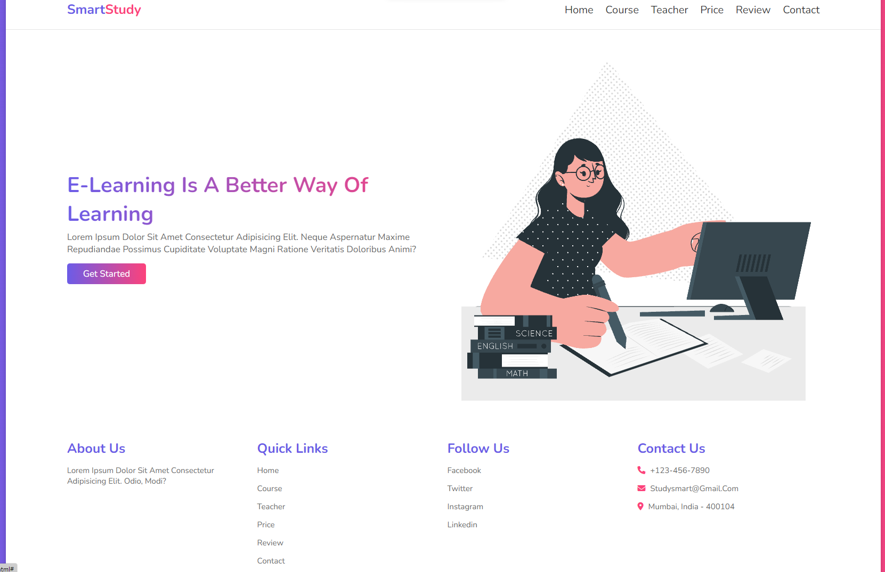
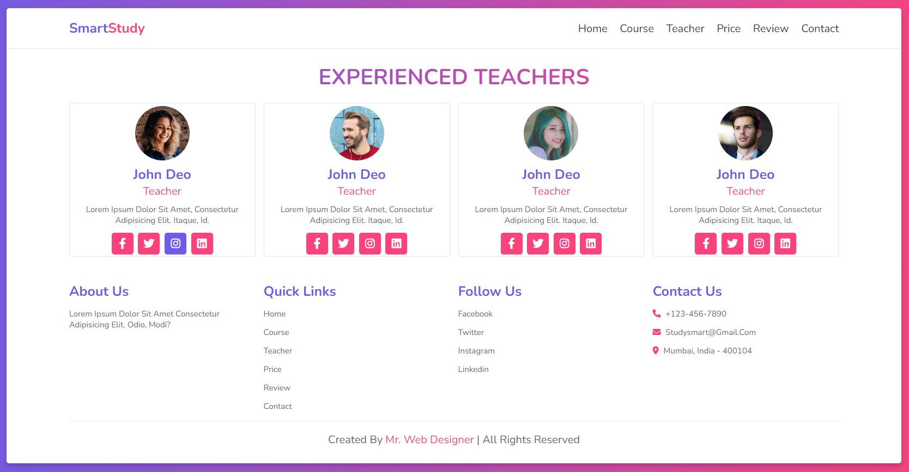

# SmartStudy
 Website Education

 

  <a href="#-tecnologias">Tecnologias</a>&nbsp;&nbsp;&nbsp;|&nbsp;&nbsp;&nbsp;
  <a href="#-projeto">Projeto</a>&nbsp;&nbsp;&nbsp;|&nbsp;&nbsp;&nbsp;

 
 

## 🚀 Tecnologias

Esse projeto foi desenvolvido com as seguintes tecnologias:

- HTML
- SCSS
- JavaScript

## 💻 Projeto

O SmartStudy é um exemplo de site de curso com um design bem elaborado. 🥙
## Icones

- :package: nova funcionalidade
- :up: atualização
- :beetle: correção de bug
- :checkered_flag: release
